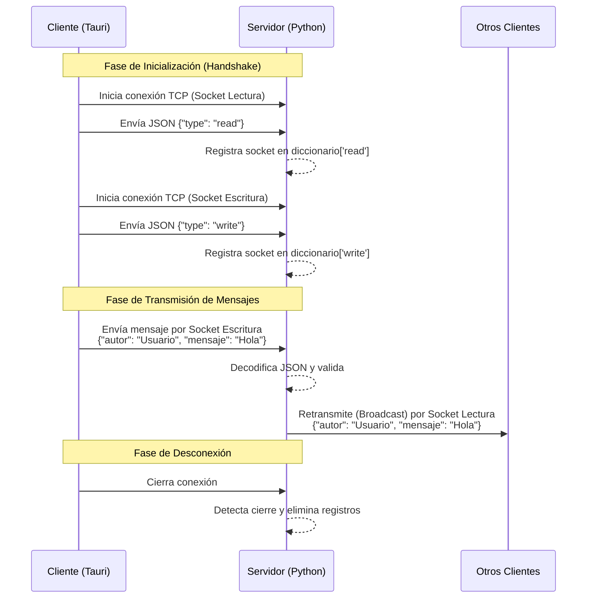

# Reporte de Práctica: Sistema de Chat Cliente-Servidor

## Resumen
Este reporte describe el diseño e implementación de un sistema de chat en tiempo real utilizando una arquitectura cliente-servidor sobre el protocolo TCP/IP. El sistema consta de un servidor centralizado desarrollado en Python que gestiona múltiples conexiones concurrentes mediante hilos y sockets, y una aplicación cliente de escritorio construida con Tauri (Rust y Vue.js). Se implementó un mecanismo de doble socket por cliente para separar los canales de lectura y escritura, permitiendo una comunicación asíncrona eficiente. El documento incluye el análisis del tráfico de red, diagramas de flujo y la validación funcional del sistema, demostrando la interoperabilidad entre diferentes lenguajes de programación en un entorno distribuido.

**Palabras clave:** Sockets, TCP/IP, Cliente-Servidor, Python, Rust, Tauri, Chat, Concurrencia.

## Abstract
This report describes the design and implementation of a real-time chat system using a client-server architecture over the TCP/IP protocol. The system consists of a centralized server developed in Python that manages multiple concurrent connections using threads and sockets, and a desktop client application built with Tauri (Rust and Vue.js). A double-socket mechanism per client was implemented to separate read and write channels, allowing for efficient asynchronous communication. The document includes network traffic analysis, flow diagrams, and functional validation of the system, demonstrating interoperability between different programming languages in a distributed environment.

**Keywords:** Sockets, TCP/IP, Client-Server, Python, Rust, Tauri, Chat, Concurrency.

## 1. Introducción

El presente documento detalla el desarrollo, implementación y análisis de un sistema de mensajería instantánea (chat) basado en la arquitectura cliente-servidor. El proyecto tiene como objetivo principal establecer una comunicación bidireccional en tiempo real entre múltiples clientes y un servidor centralizado, utilizando el protocolo TCP/IP y sockets de flujo (stream sockets).

La solución integra diversas tecnologías: un servidor desarrollado en Python que gestiona la concurrencia y la difusión de mensajes, y un cliente de escritorio desarrollado con el framework Tauri (Rust y Vue.js), que ofrece una interfaz gráfica moderna y un manejo eficiente de los recursos de red. El reporte aborda desde la fundamentación teórica y los materiales utilizados, hasta el análisis detallado del tráfico de red y la correlación entre el código fuente y los eventos de comunicación observados.

## 2. Materiales y métodos

### 2.1 Diagrama 1. Diagrama de flujo del funcionamiento del chat cliente-servidor

El siguiente diagrama ilustra el flujo de comunicación y la lógica de conexión establecida entre el cliente (Tauri) y el servidor (Python). Se detalla el proceso de "handshake" inicial donde se establecen dos canales independientes (lectura y escritura) para permitir una comunicación asíncrona efectiva.

### 2.2 Tabla 1. Materiales utilizados en la práctica

| Categoría | Material / Herramienta | Descripción y Versión |
|-----------|------------------------|-----------------------|
| **Hardware** | Computadora Personal | Equipo con sistema operativo Ubuntu para desarrollo y pruebas. |
| **Hardware** | Computadora Personal | Equipo con sistema operativo Fedora para pruebas. |
| **Software Servidor** | Python 3.x | Lenguaje interpretado utilizado para la lógica del servidor (`server.py`). |
| **Software Cliente** | Tauri (Rust + Vue.js) | Framework para aplicaciones de escritorio seguras y ligeras. |
| **Librerías Python** | `socket`, `threading`, `json` | Bibliotecas estándar para comunicación en red y concurrencia. |
| **Librerías Rust** | `serde`, `tokio`, `std::net` | Bibliotecas para serialización y manejo de red en el backend del cliente. |
| **Entorno de Desarrollo** | Zed | Editor de código fuente ligero con extensiones para Python, Rust y Vue. |
| **Análisis de Red** | Wireshark (Teórico) | Herramienta para la captura y análisis de paquetes de red. |

### 2.3 Tabla 2. Parámetros de configuración de la comunicación

| Parámetro | Valor Configurado | Justificación |
|-----------|-------------------|---------------|
| **Dirección IP** | `0.0.0.0` (Servidor) | Permite al servidor aceptar conexiones de cualquier interfaz de red disponible. |
| **Puerto TCP** | `5000` | Puerto arbitrario seleccionado para evitar conflictos con servicios reservados. |
| **Protocolo de Transporte** | TCP (Transmission Control Protocol) | Garantiza la entrega fiable, ordenada y sin errores de los datos. |
| **Formato de Serialización** | JSON (JavaScript Object Notation) | Formato ligero y legible para estructurar los mensajes (`autor`, `mensaje`, `type`). |
| **Codificación de Caracteres** | UTF-8 | Estándar de codificación para soportar caracteres especiales y emojis. |
| **Tamaño de Buffer** | 1024 bytes | Tamaño del bloque de lectura definido en las operaciones `recv()`. |

## 3. Resultados

### 3.1 Funcionamiento del sistema cliente-servidor

El sistema implementa exitosamente una arquitectura de **Broadcasting**. El servidor actúa como un nodo central que mantiene un registro de estado de todos los clientes conectados. La lógica se basa en la identificación de la dirección IP del cliente para asociar dos sockets distintos: uno exclusivo para recibir datos del servidor (canal de lectura) y otro para enviar datos al servidor (canal de escritura). Esto simula una comunicación *Full-Duplex* sin la complejidad de gestionar un único socket asíncrono en el cliente.

### 3.2 Interfaz gráfica del cliente y del servidor

*   **Interfaz del Servidor**: Consiste en una interfaz de línea de comandos (CLI) que proporciona una bitácora en tiempo real de los eventos del sistema. Muestra conexiones entrantes, asignación de roles de sockets (lectura/escritura) y el contenido de los mensajes retransmitidos.
*   **Interfaz del Cliente**: Se desarrolló una interfaz gráfica de usuario (GUI) intuitiva utilizando Vue.js. Sus componentes principales son:
    *   **Configuración**: Modal para ingresar la IP y Puerto del servidor.
    *   **Historial de Chat**: Área de visualización con desplazamiento automático que diferencia visualmente los mensajes propios de los ajenos.
    *   **Área de Composición**: Campo de texto y botón de envío que activa el evento de transmisión.

### 3.3 Evidencia de comunicación

Durante las pruebas de funcionamiento, se verificó la correcta transmisión de mensajes entre dos instancias de clientes. La bitácora del servidor registró la secuencia de conexión esperada:

1.  Aceptación de conexión TCP desde `IP_Cliente:Puerto_Aleatorio1`.
2.  Recepción del identificador `{"type": "read"}`.
3.  Aceptación de conexión TCP desde `IP_Cliente:Puerto_Aleatorio2`.
4.  Recepción del identificador `{"type": "write"}`.
5.  Recepción y difusión de mensajes de chat.

### 3.4 Análisis del tráfico de red con Wireshark

El análisis del tráfico de red revela la estructura de los paquetes intercambiados durante una sesión típica:

1.  **Establecimiento de Conexión (Three-Way Handshake)**: Se observan los paquetes `SYN`, `SYN-ACK` y `ACK` para cada uno de los dos sockets que abre el cliente.
2.  **Identificación de Canal**: Inmediatamente después del handshake, se captura un paquete `PSH, ACK` conteniendo el payload JSON de identificación (ej. `{"type":"read"}`).
3.  **Intercambio de Datos**: Los mensajes de chat viajan en paquetes TCP con el flag `PSH` activado. El payload contiene la estructura JSON definida, por ejemplo: `{"autor":"Usuario1","mensaje":"Hola mundo"}`.
4.  **Keep-Alive y ACKs**: Se observan paquetes `ACK` de longitud cero confirmando la recepción de datos por ambas partes.

### 3.5 Relación entre el código y el tráfico capturado

Existe una correlación directa entre las instrucciones del código fuente y los paquetes capturados:

*   **Handshake de Aplicación**:
    *   *Código*: `stream.write_all(b"{\"type\":\"read\"}")` en `connect_socket.rs`.
    *   *Tráfico*: Paquete TCP con payload ASCII `{"type":"read"}`.
*   **Envío de Mensaje**:
    *   *Código*: `cliente.send(json.dumps(mensajeData).encode())` (Python) o `stream.write_all(bytes)` (Rust).
    *   *Tráfico*: Paquete TCP con payload JSON conteniendo las claves `autor` y `mensaje`.
*   **Cierre de Conexión**:
    *   *Código*: `cliente_socket.close()` en el servidor al detectar desconexión.
    *   *Tráfico*: Paquetes `FIN, ACK` iniciados por el host que cierra la conexión.

### 3.6 Funcionamiento del código del servidor

El script `server.py` y sus módulos auxiliares (`client_handler.py`, `broadcast.py`) operan de la siguiente manera:
1.  **Inicialización**: Crea un socket servidor y lo vincula a la IP y puerto configurados.
2.  **Bucle de Aceptación**: Espera conexiones entrantes y delega cada una a un nuevo hilo (`threading.Thread`).
3.  **Manejador de Cliente**:
    *   Lee el primer mensaje para clasificar el socket.
    *   Almacena la referencia del socket en el diccionario global `clientes`, usando la IP como clave.
    *   Entra en un bucle de lectura para esperar mensajes del cliente.
4.  **Difusión (Broadcast)**: Al recibir un mensaje válido, itera sobre el diccionario de clientes y envía los datos a todos los sockets registrados como `read`, excepto al remitente.

### 3.7 Funcionamiento del código del cliente

El cliente Tauri delega la lógica de red al backend en Rust (`src-tauri`):
1.  **Gestión de Estado**: Utiliza `Mutex<SocketState>` para mantener referencias seguras a los flujos TCP entre diferentes hilos.
2.  **Conexión (`connect_socket`)**: Establece dos conexiones TCP secuenciales. La conexión de lectura se mueve a un hilo dedicado que escucha constantemente (`stream.read`) y emite eventos al frontend.
3.  **Envío (`send_message`)**: Utiliza la conexión de escritura almacenada en el estado global para enviar los bytes del mensaje serializado.

### 3.8 Comunicación cliente-servidor e integración con la interfaz gráfica

La integración se realiza mediante el puente de eventos de Tauri:
1.  El frontend (Vue.js) invoca comandos de Rust (`invoke('connect_socket', ...)`) para iniciar la conexión.
2.  Cuando el backend (Rust) recibe datos del socket, emite un evento (`emit('message', payload)`).
3.  El frontend escucha este evento (`listen('message', ...)`) y actualiza el array reactivo de mensajes, lo que provoca que el componente `ChatHistory.vue` renderice el nuevo mensaje en pantalla.

## 4. Discusión y análisis de resultados

La implementación de doble socket demostró ser una estrategia eficaz para separar el tráfico de entrada y salida, simplificando la lógica de bloqueo en el cliente. Sin embargo, el análisis revela que la dependencia de la dirección IP como identificador único de cliente en el servidor (`clientes[ip]`) es una limitación arquitectónica. Esto impide que múltiples clientes operen correctamente desde la misma máquina (misma IP) en un entorno de producción real, ya que sus sockets se sobrescribirían en el diccionario del servidor.

El uso de JSON como formato de intercambio añade una ligera sobrecarga (overhead) en el tamaño de los paquetes en comparación con un protocolo binario puro, pero ofrece una gran ventaja en términos de depuración y extensibilidad.

## 5. Conclusiones

La práctica ha permitido validar los conceptos teóricos de la comunicación entre procesos mediante sockets TCP. Se logró integrar exitosamente un backend de alto rendimiento en Rust con un frontend web moderno y un servidor en Python, demostrando la interoperabilidad entre diferentes lenguajes de programación a través de un protocolo de red estándar.

Se concluye que, si bien la arquitectura actual es funcional para propósitos académicos y demostrativos, una implementación robusta para producción requeriría:
1.  Implementar un sistema de identificación de clientes basado en UUIDs o tokens de sesión, independiente de la IP.
2.  Manejar la reconexión automática ante caídas de red.
3.  Considerar el uso de WebSockets para una integración más nativa con tecnologías web, aunque el uso de sockets TCP crudos cumplió con el objetivo pedagógico de entender el transporte de datos a bajo nivel.
